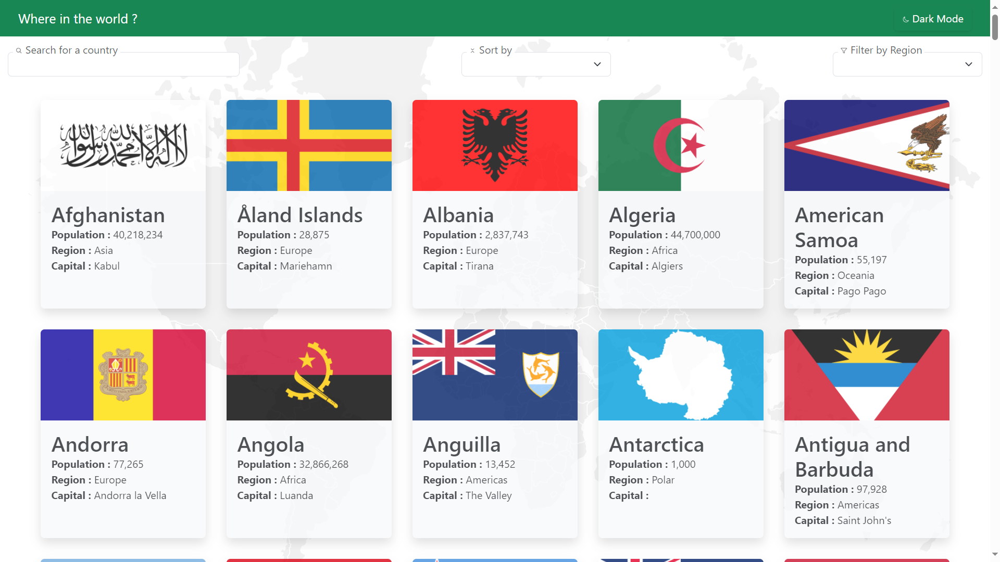
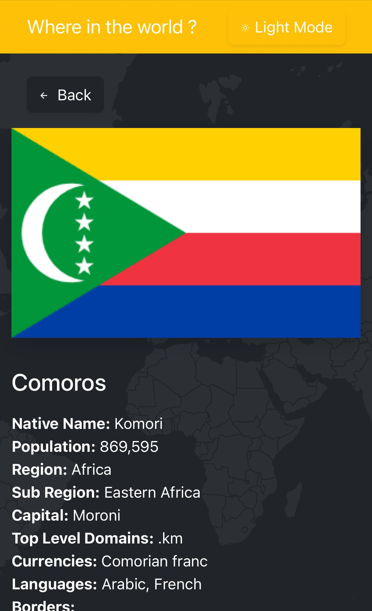

# Frontend Mentor - REST Countries API with color theme switcher solution

This is a solution to the [REST Countries API with color theme switcher challenge on Frontend Mentor](https://www.frontendmentor.io/challenges/rest-countries-api-with-color-theme-switcher-5cacc469fec04111f7b848ca). Frontend Mentor challenges help you improve your coding skills by building realistic projects. 

## Table of contents

- [Overview](#overview)
  - [The challenge](#the-challenge)
  - [Screenshot](#screenshot)
  - [Links](#links)
- [My process](#my-process)
  - [Built with](#built-with)
  - [Continued development](#continued-development)
- [Author](#author)

## Overview

### Screenshot

### Links

- Solution URL: https://github.com/julienbouze/REST-Countries-API-with-color-theme-switcher
- Live Site URL: https://julienbouze.github.io/REST-Countries-API-with-color-theme-switcher/

## My process

### Built with

- Semantic HTML5 markup
- CSS custom properties
- Boostrap
- AngularJS
- ngRoute

### What I learned

I learned the use of Bootstrap, AngularJS, ngRoute, ngComponent, etc...

### Continued development

I want to keep improving my knowledge on javaScript frameworks like AngularJS

## Author

- Github - https://github.com/julienbouze
- Frontend Mentor - https://www.frontendmentor.io/profile/julienbouze